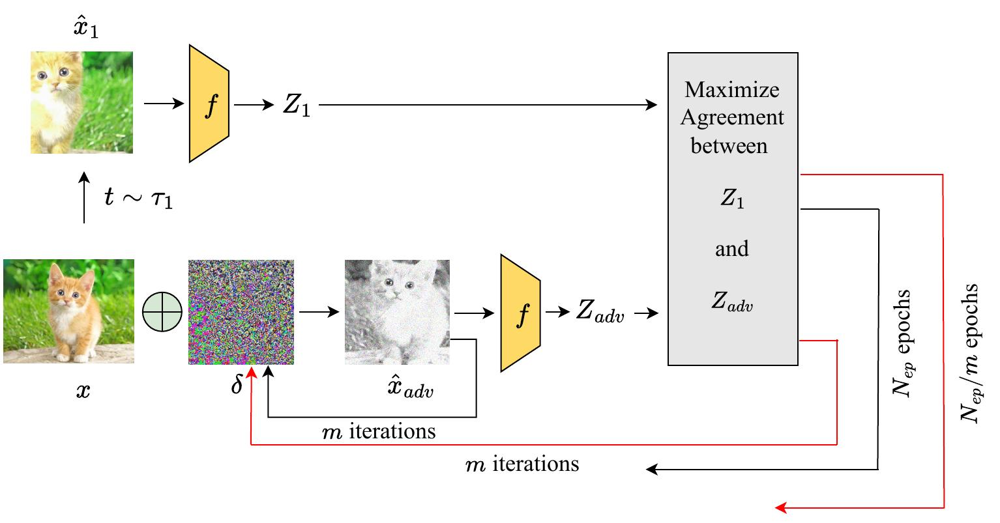

# CF-AMC-SSL: Cost-Free Adversarial Multi-Crop Self-Supervised Learning
In this work, we explored the robustness of Extreme-Multi-Patch Self-Supervised Learning (EMP-SSL) against adversarial attacks using both standard and adversarial training techniques. Our findings underscored the significant
impact of multi-scale crops within the robust EMP-SSL algorithm, enhancing model robustness without sacrificing accuracy. This improvement contrasts with robust SimCLR, which relies on only a pair of crops per image and necessitates more training epochs. Moreover, we demonstrated the efficacy of incorporating free adversarial training into methods like SimCLR and EMP-SSL, even though training epochs are limited in EMP-SSL. This integration resulted in
the development of Cost-Free Adversarial Multi-Crop Self-Supervised Learning (CF-AMC-SSL), achieving substantial advancements in both robustness and accuracy while reducing training time. 
### SimCLR Overview:
- Uses data augmentations to create two views of each data point, treating these views as positive pairs during training.
- Involves a base encoder for feature extraction, a projection head for dimensionality reduction, and a contrastive loss to maximize similarity between positive pairs and minimize it for negatives.

### EMP-SSL Overview:
- Augments images into multiple sets of patches, which are passed through an encoder to extract features.
- The training objective combines Total Coding Rate (TCR) for regularization and invariance loss for consistency across augmentations.

### Adversarial Training in Both Frameworks:

- SimCLR: Generates one adversarial example per image and treats both augmented and adversarial versions as positive pairs.
- EMP-SSL: Generates multiple adversarial examples from different augmentations of the same image and aims to align these representations for better robustness.

### Training Efficiency:

 - EMP-SSL requires fewer epochs to converge and has a reduced runtime compared to SimCLR, despite using a higher number of patches in augmentation.


## An overview of the methodology
<p align="center">

 <br>
 <em><strong>The adversarially trained SimCLR vs. free adversarially trained
SimCLR framework.</strong></em>
</p>

<p align="center">

  <br>
  <em><strong>The adversarially trained crop-based EMP-SSL framework vs.
the free adversarially trained crop-based EMP-SSL (CF-AMC-
SSL).</strong></em>
</p>

<div>


## Running

### Standard Contrastive Learning
#### Pretraining Stage
(1) Standard Training
```
python main_simclr.py
 ```
 (2) Adversarial Training
```
python main_simclr_adv.py
 ```
(3) Free Adversarial Training
```
python main_simclr_free_adv.py
 ```
#### Evaluation Stage
```
python evaluate_simclr.py
 ```
### EMP-SSL: Extreme-Multi-Patch Self-Supervised-Learning  
#### Pretraining Stage
(1) Standard Training
```
python main_empssl.py
 ```
 (2) Adversarial Training
```
python main_empssl_adv.py
 ```
(3) Free Adversarial Training
```
python main_empssl_free_adv.py
```
#### Evaluation Stage
```
python evaluate_empssl.py
```
## Acknowledement
This repo is inspired by [CL-Robustness](https://github.com/softsys4ai/CL-Robustness/tree/main) and [EMP-SSL](https://github.com/tsb0601/EMP-SSL) repos.
