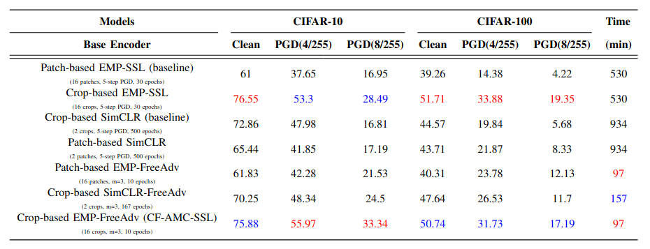

# CF-AMC-SSL: Cost-Free Adversarial Multi-Crop Self-Supervised Learning
In this work, we explored the robustness of Extreme-Multi-Patch Self-Supervised Learning (EMP-SSL) against adversarial attacks using both standard and adversarial training techniques. Our findings underscored the significant
impact of multi-scale crops within the robust EMP-SSL algorithm, enhancing model robustness without sacrificing accuracy. This improvement contrasts with robust SimCLR, which relies on only a pair of crops per image and necessitates more training epochs. Moreover, we demonstrated the efficacy of incorporating free adversarial training into methods like SimCLR and EMP-SSL, even though training epochs are limited in EMP-SSL. This integration resulted in
the development of Cost-Free Adversarial Multi-Crop Self-Supervised Learning (CF-AMC-SSL), achieving substantial advancements in both robustness and accuracy while reducing training time. 
### SimCLR Overview:
- Uses data augmentations to create two views of each data point, treating these views as positive pairs during training.
- Involves a base encoder for feature extraction, a projection head for dimensionality reduction, and a contrastive loss to maximize similarity between positive pairs and minimize it for negatives.

### EMP-SSL Overview:
- Augments images into multiple sets of patches, which are passed through an encoder to extract features.
- The training objective combines Total Coding Rate (TCR) for regularization and invariance loss for consistency across augmentations.

### Adversarial Training in Both Frameworks:

- SimCLR: Generates one adversarial example per image and treats both augmented and adversarial versions as positive pairs.
- EMP-SSL: Generates multiple adversarial examples from different augmentations of the same image and aims to align these representations for better robustness.

### Training Efficiency:

 - EMP-SSL requires fewer epochs to converge and has a reduced runtime compared to SimCLR, despite using a higher number of patches in augmentation.


## An overview of the methodology
<p align="center">

 <br>
 <em><strong>The adversarially trained SimCLR vs. free adversarially trained
SimCLR framework.</strong></em>
</p>

<p align="center">

  <br>
  <em><strong>The adversarially trained crop-based EMP-SSL framework vs.
the free adversarially trained crop-based EMP-SSL (CF-AMC-
SSL).</strong></em>
</p>

<div>


## Running

### Standard Contrastive Learning
#### Pretraining Stage
(1) Standard Training
```
python main_simclr.py
 ```
 (2) Adversarial Training
```
python main_simclr_adv.py
 ```
(3) Free Adversarial Training
```
python main_simclr_free_adv.py
 ```
#### Evaluation Stage
```
python evaluate_simclr.py
 ```
### EMP-SSL: Extreme-Multi-Patch Self-Supervised-Learning  
#### Pretraining Stage
(1) Standard Training
```
python main_empssl.py
 ```
 (2) Adversarial Training
```
python main_empssl_adv.py
 ```
(3) Free Adversarial Training
```
python main_empssl_free_adv.py
```
#### Evaluation Stage
```
python evaluate_empssl.py
```
## Comparison of Models

**CF-AMC-SSL trains efficiently in fewer epochs, thereby reducing overall training time. By effectively employing multi-crop augmentations during base encoder training, it enhances both clean accuracy and robustness against PGD attacks.**  

### Evaluation Strategies

We evaluate two strategies:

- **Crop-Based Method**: This method involves random cropping of image augmentations, where the crop sizes range from 9×9 to 32×32 pixels.
- **Patch-Based Method**: This method uses fixed-scale patches as the primary method of augmentation.

<p align="center">

 <br>
 <em><strong>Note that the highest values are indicated in red, while the second highest values are highlighted in
blue.</strong></em>
</p>
<div>


 ### Comparison of Methods

### Comparison of Methods

We evaluate several methods on CIFAR-10, CIFAR-100, and training time. Note that the highest values are in **red**, and the second-highest values are in **blue**.

### Comparison of Methods

We evaluate several methods on CIFAR-10, CIFAR-100, and training time. Note that the highest values are in **red**, and the second-highest values are in **blue**.

<table style="font-size: 12px;">
  <thead>
    <tr>
      <th><b>Models</b></th>
      <th><b>CIFAR-10 Clean</b></th>
      <th><b>CIFAR-10 PGD(4/255)</b></th>
      <th><b>CIFAR-10 PGD(8/255)</b></th>
      <th><b>CIFAR-100 Clean</b></th>
      <th><b>CIFAR-100 PGD(4/255)</b></th>
      <th><b>CIFAR-100 PGD(8/255)</b></th>
      <th><b>Time (min)</b></th>
    </tr>
  </thead>
  <tbody>
    <tr>
      <td><b>Patch-based EMP-SSL</b> (16 patches, 30 epochs)</td>
      <td>61</td>
      <td>37.65</td>
      <td>16.95</td>
      <td>39.26</td>
      <td>14.38</td>
      <td>4.22</td>
      <td>530</td>
    </tr>
    <tr>
      <td><b>Crop-based EMP-SSL</b> (16 crops, 30 epochs)</td>
      <td><b>76.55</b></td>
      <td><b>53.3</b></td>
      <td><b>28.49</b></td>
      <td><b>51.71</b></td>
      <td><b>33.88</b></td>
      <td><b>19.35</b></td>
      <td>530</td>
    </tr>
    <tr>
      <td><b>Crop-based SimCLR</b> (2 crops, 500 epochs)</td>
      <td>72.86</td>
      <td>47.98</td>
      <td>16.81</td>
      <td>44.57</td>
      <td>19.84</td>
      <td>5.68</td>
      <td>934</td>
    </tr>
    <tr>
      <td><b>Patch-based SimCLR</b> (2 patches, 500 epochs)</td>
      <td>65.44</td>
      <td>41.85</td>
      <td>17.19</td>
      <td>43.71</td>
      <td>21.87</td>
      <td>8.33</td>
      <td>934</td>
    </tr>
    <tr>
      <td><b>Patch-based EMP-FreeAdv</b> (16 patches, 10 epochs)</td>
      <td>61.83</td>
      <td>42.28</td>
      <td>21.53</td>
      <td>40.31</td>
      <td>23.78</td>
      <td>12.13</td>
      <td><b>97</b></td>
    </tr>
    <tr>
      <td><b>Crop-based SimCLR-FreeAdv</b> (2 crops, 167 epochs)</td>
      <td>70.25</td>
      <td>48.34</td>
      <td>24.5</td>
      <td>47.64</td>
      <td>26.53</td>
      <td>11.7</td>
      <td><b>157</b></td>
    </tr>
    <tr>
      <td><b>Crop-based EMP-FreeAdv (CF-AMC-SSL)</b> (16 crops, 10 epochs)</td>
      <td><b>75.88</b></td>
      <td><b>55.97</b></td>
      <td><b>33.34</b></td>
      <td><b>50.74</b></td>
      <td><b>31.73</b></td>
      <td><b>17.19</b></td>
      <td><b>97</b></td>
    </tr>
  </tbody>
</table>

## Acknowledement
This repo is inspired by [CL-Robustness](https://github.com/softsys4ai/CL-Robustness/tree/main) and [EMP-SSL](https://github.com/tsb0601/EMP-SSL) repos.
