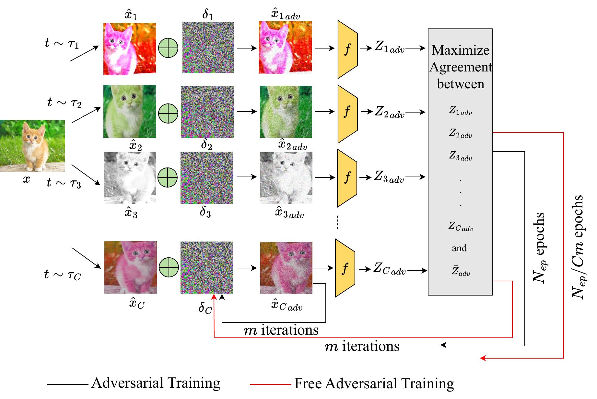

# CF-AMC-SSL
Self-supervised learning (SSL) has significantly advanced in learning image representations, yet efficiency challenges persist, particularly under adversarial training. Many SSL methods require extensive training epochs to achieve convergence, a demand further amplified in adversarial settings. To address this inefficiency, we revisit the robust EMP-SSL framework, emphasizing the crucial role of increasing the number of crops per image instance to accelerate the learning process. Unlike conventional contrastive learning, robust EMP-SSL leverages multiple crops per image, integrates an invariance term and regularization, and significantly reduces the required training epochs, enhancing time efficiency. Additionally, robust EMP-SSL is evaluated using both standard linear classifiers and multi-patch embedding aggregation, providing new insights into SSL evaluation strategies. This paper investigates these methodological improvements with a focus on adversarial robustness, combining theoretical analysis with comprehensive experimental evaluation. Our results demonstrate that robust crop-based EMP-SSL, when evaluated with standard linear classifiers, not only accelerates convergence but also achieves a superior balance between clean accuracy and adversarial robustness, outperforming multi-crop embedding aggregation. Furthermore, we extend this approach by applying free adversarial training to the Multi-Crop Self-Supervised Learning algorithm, resulting in the Cost-Free Adversarial Multi-Crop Self-Supervised Learning (CF-AMC-SSL) method. This method shows the effectiveness of free adversarial training in self-supervised learning, particularly when the number of epochs is reduced. Our findings underscore the efficacy of CF-AMC-SSL in simultaneously improving clean accuracy and adversarial robustness within a reduced training time, offering promising avenues for practical applications of SSL methodologies. 

## An overview of the methodology

  
 <em><strong>Figure 1(a) The adversarially trained SimCLR vs. free adversarially trained
SimCLR framework.</strong></em>

   
  <em><strong>Figure 1(b) he adversarially trained crop-based EMP-SSL framework vs.
the free adversarially trained crop-based EMP-SSL (CF-AMC-
SSL).</strong></em>

